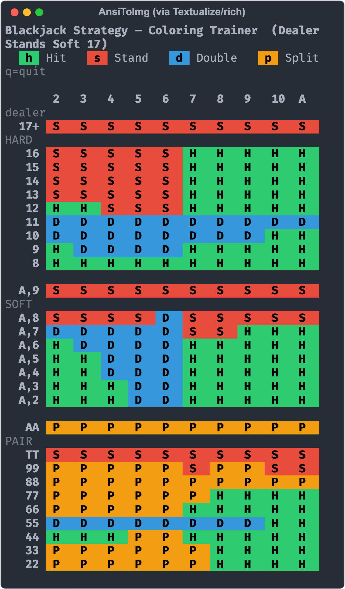

# blackjack-trainer

Terminal trainer for memorizing blackjack basic strategy (Dealer Stands Soft 17).

You reconstruct the strategy chart from memory, cell by cell, typing the action
for each hand. The grid redraws as you go so you watch the picture fill in; wrong
cells are flagged in yellow and re-drilled until the whole chart is clean.

<p align="center">
  
</p>

## Setup

```sh
uv sync
```

## Run

```sh
uv run blackjack-trainer map                      # whole chart, top-left to bottom-right
uv run blackjack-trainer map --order random-row   # whole rows shuffled, cells left-to-right
uv run blackjack-trainer map --order random       # final boss: every cell shuffled
uv run blackjack-trainer map --section PAIR        # drill one section (HARD|SOFT|PAIR)
uv run blackjack-trainer map --order random --section SOFT   # flags compose
```

`--order` defaults to `in-order`; `--section` defaults to the whole chart.

Keys: `h` Hit · `s` Stand · `d` Double · `p` Split · `q` quit

Needs a real terminal (single-keypress input) and a truecolor-capable emulator.

## Dev

```sh
uv run ruff check .
uv run ruff format .
```
